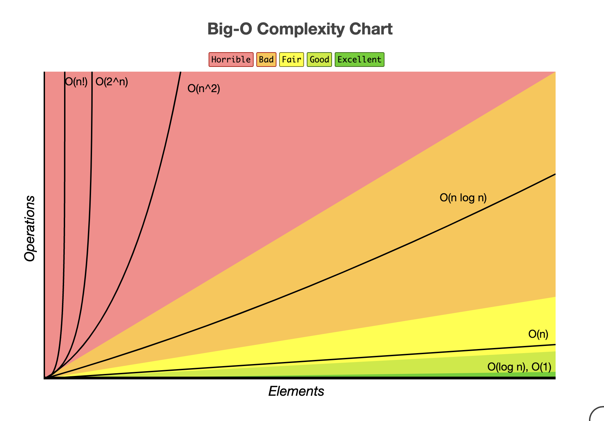

# Introduction to Data Structures, Algorithms, and Acing Coding Interviews with Ruby 🕴️

Welcome to the next step in your journey as a budding software developer. Having gained a solid foundation in Ruby and full-stack web development with Rails, you're now poised to delve deeper into the world of data structures and algorithms. This module is designed to arm you with the tools and knowledge necessary to excel in technical interviews and solve complex problems efficiently. Let's embark on this adventure together, where you will not only sharpen your coding skills but also become adept at thinking critically about algorithmic challenges.

## Embracing Big O Notation: The Gateway to Efficiency 📈
Before we dive into specific data structures and algorithms, let's talk about Big O Notation. Big O Notation is a mathematical notation that describes the complexity of your algorithm in terms of time and space. It's a crucial concept for understanding how well an algorithm scales as the size of the input data increases. Think of it as a way to quantify the efficiency of your solution, helping you to identify whether you're truly inventing the most effective approach to a problem.


[source](https://www.bigocheatsheet.com/)

Let's dive into some example code snippets in Ruby, illustrating common data structures and algorithms along with their associated Big O notations. These examples will help you understand how these concepts apply in real-world coding scenarios, particularly in the context of technical interviews.

### Iterating over an Array
```ruby
numbers = [1, 2, 3, 4, 5]
numbers.each do |number|
  puts number
end
```

**Time Complexity**: O(n) - This is because each element in the array is visited exactly once, so the time it takes to complete this operation scales linearly with the size of the array.

**Space Complexity**: O(1) - The space required does not grow with the size of the input array since we're only printing the elements without storing anything extra.

### Hash Lookup
```ruby
students = {"Alice" => 90, "Bob" => 85, "Charlie" => 95}
puts students["Alice"]
```

**Time Complexity**: O(1) - Looking up a value in a hash by its key is a constant-time operation, meaning it takes the same amount of time regardless of the size of the hash.

**Space Complexity**: O(n) - The space complexity is linear with respect to the number of key-value pairs stored in the hash. However, the operation of looking up a value is O(1) in time complexity.

### Binary Search
```ruby
def binary_search(array, value, from=0, to=nil)
    to = array.count - 1 unless to
    mid = (from + to) / 2

    if value < array[mid]
        return binary_search(array, value, from, mid - 1)
    elsif value > array[mid]
        return binary_search(array, value, mid + 1, to)
    else
        return mid
    end
end

sorted_numbers = [1, 4, 7, 9, 15, 24, 30]
puts binary_search(sorted_numbers, 15)
```

**Time Complexity**: O(log n) - Binary search has a logarithmic time complexity because it splits the search interval in half each time, significantly reducing the number of comparisons needed to find the target value.

**Space Complexity**: O(log n) due to the call stack, which uses space proportional to the depth of the recursion, which is logarithmic.

### Bubble Sort

```ruby
def bubble_sort(array)
  n = array.length
  loop do
    swapped = false

    (n-1).times do |i|
      if array[i] > array[i+1]
        array[i], array[i+1] = array[i+1], array[i]
        swapped = true
      end
    end

    break unless swapped
  end
  array
end

unsorted_numbers = [4, 2, 7, 1, 3]
puts bubble_sort(unsorted_numbers).inspect
```

**Time Complexity**: O(n^2) - Bubble sort is an example of a quadratic time complexity algorithm because it involves nested iterations over the collection, making it less efficient for large datasets.

**Space Complexity**: O(1) - Bubble sort sorts the array in place and does not require additional storage that grows with the input size, making its space complexity constant.

### Recursive Fibonacci

```ruby
def fibonacci(n)
  return n if n <= 1
  fibonacci(n-1) + fibonacci(n-2)
end

puts fibonacci(5)
```

**Time Complexity**: O(2^n) - The time complexity of the recursive Fibonacci algorithm is exponential due to the fact that it generates an exponentially growing number of function calls.

**Space Complexity**: O(n) - The space complexity of the recursive Fibonacci is linear in the worst case due to the call stack. For each function call, a new frame is added to the call stack, and in the worst case, there are 'n' recursive calls for computing fibonacci(n).

## Data Structures: The Building Blocks 🧱
Data structures are foundational concepts that enable us to organize and store data in a way that facilitates efficient access and modification. Here are some of the key structures you'll learn about:

- **Arrays**: You're already familiar with these from Ruby. They allow you to store a list of items in a specific order.
- **Hashes**: Also known as dictionaries in other languages, hashes map keys to values, enabling fast retrieval based on a key.
- **Linked Lists**: A collection of nodes that together form a sequence. Each node contains data and a reference to the next node in the sequence.
- **Trees**: Hierarchical data structures that consist of nodes in a parent/child relationship.
- **Graphs**: Collections of nodes (vertices) connected by edges. Useful for modeling networks like social connections or maps.

Understanding these structures is paramount as they form the basis of more complex algorithms and problem-solving techniques.

## Algorithms: The Logic Behind the Magic 🧙‍♂️
An algorithm is a step-by-step procedure for performing a task or solving a problem. Mastering algorithms means understanding a set of core principles that can be applied to a wide range of challenges. You'll learn about:

- **Sorting Algorithms**: Such as bubble sort, selection sort, and more efficient ones like quicksort and mergesort.
- **Search Algorithms**: Including linear search and binary search, understanding their differences in complexity.
- **Recursive Algorithms**: Techniques that solve problems by solving smaller instances of the same problem.
- **Dynamic Programming**: A method for solving complex problems by breaking them down into simpler subproblems.

## Acing the Coding Interview: Strategies and Mindset 🤔
The coding interview is your opportunity to showcase your problem-solving skills, logical thinking, and mastery of data structures and algorithms. Here are some tips to help you prepare:

- **Practice, Practice, Practice**: There's no substitute for hands-on problem-solving. Use platforms like [LeetCode](https://leetcode.com/), [HackerRank](https://www.hackerrank.com/), and others to hone your skills.
- **Understand the Problem**: Before jumping into code, make sure you fully understand what's being asked. Clarify any doubts with your interviewer.
- **Think Aloud**: Interviewers want to see how you approach problems. Verbalize your thought process and write pseudocode as you break down the problem and explore solutions.
- **Start with a Brute Force Solution**: It's okay to start with a simpler, less efficient solution. You can always refine it later.
- **Test Your Code**: Before declaring that you're done, test your solution with different inputs to ensure it handles edge cases.

## Emulating the Inventor Mindset 💡
As you progress through this module, remember the ethos of being an inventor. Just as you've learned to creatively combine Ruby's building blocks to solve problems, you'll now apply a similar mindset to algorithmic challenges. Approach each problem with curiosity, leveraging your understanding of data structures and algorithms to devise innovative solutions.

This module is not just about preparing you for job interviews; it's about cultivating a deeper understanding of computer science principles that will make you a better developer. As you complete the exercises and projects ahead, keep the lessons from your Ruby journey close at hand. They're not just stepping stones but foundational elements of the inventive solutions you'll create.

Good luck, and remember to ask questions, experiment, and, most importantly, enjoy the process of learning and discovery.
